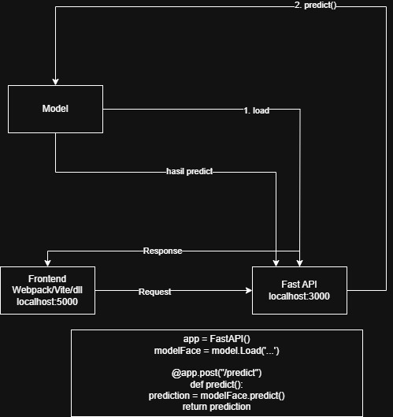

# 🎯 Face Recognition Web App (FastAPI + TensorFlow Lite)

Aplikasi ini adalah sistem **pengenalan wajah berbasis web** yang mengenali pengguna secara otomatis melalui webcam atau gambar yang diunggah. Aplikasi akan mencocokkan wajah yang terdeteksi dengan data pengguna, lalu menampilkan informasi **tiket**, **jadwal keberangkatan**, dan **sisa waktu** menuju keberangkatan.

---

## 📁 Struktur Folder Proyek

```
face-recognition-app/
├── back-end/
│   ├── main.py                     # FastAPI backend
│   ├── model.py                    # Model TensorFlow Lite + prediksi
│   ├── model.tflite                # Model wajah terlatih (TFLite)
│   ├── labelmap.npy                # Mapping nama → label
│   ├── jadwal_kereta.csv           # Data tiket dan jadwal pengguna
│   ├── haarcascadefrontalface_default.xml # Detektor wajah (OpenCV)
│   ├── Procfile                    # Deployment via Railway (Opsional)
│   └── requirements.txt            # Dependensi Python
├── front-end/
│   ├── index.html                  # Antarmuka pengguna
│   ├── script.js                   # Kamera, deteksi, dan request API
│   └── style.css                   # Tampilan halaman
├── Topologi.jpg                    # Gambar topologi sistem
└── README.md                       # Dokumentasi ini
```

---

## 🧭 Arsitektur Sistem

Sistem ini terdiri dari dua bagian utama:

1. 🎨 **Frontend Web** — HTML, CSS, dan JavaScript untuk antarmuka pengguna  
2. ⚙️ **Backend API (FastAPI)** — Mengelola proses deteksi wajah dan prediksi

📌 Gambar topologi sistem:



---

## 🚀 Cara Menjalankan Proyek Secara Lokal

### 1. Clone Repository

```bash
git clone https://github.com/username/face-recognition-app.git
cd face-recognition-app
```

### 2. Buat Virtual Environment

```bash
# Mac/Linux
python3 -m venv venv
source venv/bin/activate

# Windows
python -m venv venv
venv\Scripts\activate
```

### 3. Install Dependencies

```bash
pip install -r back-end/requirements.txt
```

### 4. Jalankan Backend FastAPI

```bash
cd back-end
uvicorn main:app --reload
```

📡 Server berjalan di: [http://127.0.0.1:8000](http://127.0.0.1:8000)

---

## 💡 Cara Menggunakan Aplikasi

1. Buka browser dan akses: [http://127.0.0.1:8000](http://127.0.0.1:8000)  
2. Izinkan akses kamera saat diminta  
3. Arahkan wajah ke kamera  
4. Sistem akan secara otomatis mengenali wajah  
5. Informasi berikut akan ditampilkan di bawah kamera:
   - 🧑 Nama
   - 🎫 Tiket
   - 🚆 Jadwal keberangkatan
   - ⏳ Sisa waktu
   - 📢 Pesan informasi tambahan

---

## ✅ Catatan Tambahan

- Pastikan webcam aktif dan browser memiliki izin kamera.
- Format CSV `jadwal_kereta.csv` harus sesuai (Nama, Tiket, Jadwal).
- Model `.tflite` dan `labelmap.npy` harus sudah dilatih sebelumnya.

---

## 📌 Lisensi

GNU General Public License v3.0 – [AidlF4jr1i / CC25-CR349]
